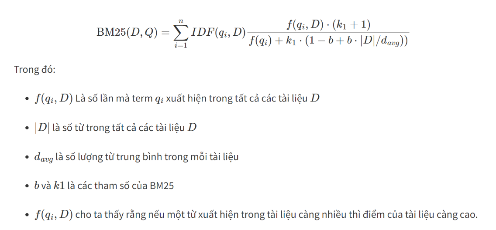

# End-to-end question-answering system
==============================

Đồ án cuối kì môn học thống kê (statiscal learning).

## Project Organization
------------

    ├── LICENSE
    ├── README.md          <- File README
    ├── data
    │   ├── processed      <- Dữ liệu đã qua bước tiền xử lý
    │   └── raw            <- Dữ liệu thô.
    │
    ├── models             <- Các checkpoint, models đã train.
    │
    ├── notebooks          <- Các file notebooks tiền xử lý dữ liệu, chạy lần lượt theo thứ tự từ trên xuống.
    │                         
    │                         
    │
    │
    ├── reports            <- Báo cáo.
    │   └── report.pdf     
    │
    ├── requirements.txt   <- The requirements file for reproducing the analysis environment, e.g.
    │                         generated with `pip freeze > requirements.txt`
    │
    └── src                <- Source code để thực hiện inference
    │   │
    │   ├── features       <- Scripts để processing dữ liệu
    │   │   |── text_utils.py       <- Các hàm để tiền xử lý dữ liệu
    │   |   └── graph_utils.py      <- Tiền xử lý dữ liệu dạng graph cho qa model
    │   │
    │   └── models         <- Scripts để sử dụng các models đã train để predict
    │   │   │             
    │   │   ├── predict_model.py     <- Inference kết quả
    │   │   |── bm25_utils.py        <- Class BM25    
    │   │   |── pairwise_model.py    <- Class Pairwise model
    │   │   └── qa_model.py          <- Class QA model
    │   │
    │   └── app.py         <- Streamlit app để chạy inference
    │
    └── submission
        └── submission.csv <- File submission

--------
## Demo: [https://www.youtube.com/watch?v=dDLh55HYrfg](https://www.youtube.com/watch?v=dDLh55HYrfg)
--------
##  Model: [https://huggingface.co/foxxy-hm/e2eqa-wiki](https://huggingface.co/foxxy-hm/e2eqa-wiki)
##  Data: [https://huggingface.co/datasets/foxxy-hm/e2eqa-wiki](https://huggingface.co/datasets/foxxy-hm/e2eqa-wiki)
--------
## Solution: 
#### 1. Cắt dữ liệu thành các sliding windows có kích thước 256.
#### 2. Tìm các ứng viên cho context với query nhập vào bằng thuật toán BM25.
Để xác định mức độ liên quan giữa một truy vấn (tài liệu) với một tài liệu khác, chúng ta có thể sử dụng công thức tính BM25 như sau:

#### 3. Ranking lại top các ứng viên bằng mô hình BERT sentence pair
BERT sentence pair ranking là một kỹ thuật sử dụng mô hình BERT để đánh giá mức độ tương đồng ngữ nghĩa giữa hai câu, ví dụ như một câu truy vấn và một đoạn văn bản. Kỹ thuật này có thể được áp dụng cho nhiều bài toán trong truy xuất thông tin (information retrieval) và trả lời câu hỏi (question answering), bằng cách sử dụng BERT để lọc lại (re-rank) các kết quả truy xuất được từ một hệ thống tìm kiếm cơ bản. BERT sentence pair ranking có thể cải thiện chất lượng của kết quả truy xuất bằng cách khắc phục các trường hợp không khớp từ khóa (keyword mismatch) hoặc sai chính tả (typos) trong câu truy vấn
#### 4. Tìm ứng viên cho câu trả lời dựa từ context đã tìm được, dựa vào thuật toán Louvain clustering.
#### 5. Tìm các ứng viên articles cho câu trả lời dựa vào thuật toán BM25 và ranking lại bằng mô hình BERT sentence pair khác để tìm ra kết quả cuối cùng. 
## Gồm các giai đoạn:
### Tiền xử lý và làm sạch dữ liệu
- 0.0-create-sliding-window.ipynb: Tiền xử lý cơ bản (chuyển về dạng viết thường và loại bỏ dấu, loại bỏ appending title), sử dụng sliding window để cắt data wiki thành các window kích thước 256 words: ví dụ: từ 1 mẫu data gồm title và text có thể tạo thành nhiều mẫu của cùng title ấy và text khác nhau. Từ đó tăng cường dữ liệu cho mỗi title và không bỏ phí các text trong quá trình tokenize (truncation). (wikipedia_20220620_cleaned.jsonl => wikipedia_20220620_cleaned_v2.csv)
- 0.1-find-dirty-data.ipynb: Tiền xử lý (xoá bỏ các khoảng trắng, dấu câu dư thừa ở đầu và cuối, tokenize,...). Lọc ra dữ liệu df từ wikipedia_20220620_cleaned_v2.csv (có title trong wikipedia_20220620_cleaned_v2.csv trùng với title trong zac2022_train_merged_final.json - tập dữ liệu đã làm sạch từ ban tổ chức cuộc thi). Thêm trường dữ liệu “dirty_text” với title của zac2022_train_merged_final.json không nằm trong tập dữ liệu df thì dữ liệu đó là clean, ngược lại là dirty. (Output: zac2022_train_merged_final.json đã thêm trường “dirty_text”)
- 0.2-create-stage1-ranking.ipynb: Chia tập val là một phần của tập dữ liệu FULL_ANNOTATION (zac2022_train_merged_final.json). Thêm trường label cho tập dữ liệu train, nhãn 1 nếu là FULL_ANNOTATION hoặc IS_LONG_ANSWER. Trường text là text ban đầu hoặc dirty_text (nếu có).
(zac2022_train_merged_final.json => train_stage1_ranking.csv)
- 0.3-create-stage2-ranking.ipynb: Sử dụng thuật toán BM25 để ranking cho các title, từ đó tính topk title cho mỗi query (sử dụng trường short_candidate như các câu query), nếu topk của query chưa có true_id thì thêm true_id của câu trả lời vào. Cuối cùng, thêm trường “label” với nhãn 1 cho câu trả lời đúng và nhãn 0 cho câu trả lời sai, trường “group” để đánh dấu các ứng viên của 1 query (mỗi group chỉ có 1 câu trả lời đúng). (wikipedia_20220620_cleaned_v2.csv => train_stage2_ranking.csv).
- 0.4-find-redirects.ipynb: Tìm các redirect trong data wikipedia dumps và update cho tập thực thể ban đầu. (OUTPUT: entities.json).
### Training 
- 1.0-train-bm25-stage1.ipynb: Tiền xử lý (tạo corpus, dictionary) và train bm25 trên tập dữ liệu wikipedia_20220620_cleaned_v2.csv 
- 1.1-train-bm25-stage2.ipynb: Tiền xử lý và train bm25 cho tập dữ liệu thô  wikipedia_20220620_cleaned.jsonl
- 1.2-train-pairwise-stage1.ipynb: train Pairwise model sử dụng kfold validation cho tập dữ liệu train_stage1_ranking.csv
- 1.3-train-pairwise-stage2.ipynb: train Pairwise Model sử dụng kfold validation cho tập dữ liệu train_stage2_ranking.csv
- 1.4-robust-qa-model.ipynb: Sử dụng tập dữ liệu df_za2022_partial_anno_pseudo_label.csv, df_za_2019_pseudo_label.csv là 2 tập dữ liệu được inference từ pre-trained model “nguyenvulebinh/vi-mrc-base” cho zac2022_train_merged_final.json với category PARTIAL_ANNOTATION và tập dữ liệu của cuộc thi năm 2019. Sau đó tiến hành tiền xử lý cho từng tập dữ liệu: tạo “context”, “question”, “answer_text” và “answer_start_idx”, lưu lại thành file qa_full_anno_train.json. Tương tự cho tập val, ta được file qa_full_anno_valid.json. Cuối cùng, sử dụng pre-trained model và squad (stanford question and answering dataset) metric để train.
### Inference
- features/text_utils.py: Chứa các hàm tiền xử lý dữ liệu
- featues/graph_utils.py: Chứa hàm find_best_cluster nhận 1 list các answer và 1 best answer làm đầu vào, sử dụng thuật toán Louvain clustering để tìm ra best cluster.
- models/bm25_utils.py: Class BM25Gensim để tính score của topk candidate. Gồm có 2 stage: 
- stage1: tính topk dựa vào query.
- stage2: tính topk dựa vào query và raw_answer, nếu raw_answer thuộc entity_dict thì thêm id của nó vào topk
- models/pairwise_model.py: Class PairwiseModel gồm 2 stage:
    - stage1: predict dựa vào question và texts.
    - stage2: predict dựa vào question, answer, titles, texts
- models/qa_model.py: Class QAEnsembleModel: duyệt lần lượt qua các candidate context của 1 question và thực hiện predict, sau đó kết hợp với hàm find_best_clustere để chọn ra kết quả tốt nhất.
- models/predict_model.py: thực hiện load các checkpoint và dữ liệu cần thiết. Sau đó, thực hiện retrieve để chọn ra top 200 title và context phù hợp nhất với question. Tiếp theo thực hiện reranking bằng BERT sentence pair. Cuối cùng dùng một qa model để tìm ra best answer tương ứng với từng stage (entities mapping).
- app.py: deploy mô hình lên môi trường web bằng streamlit

